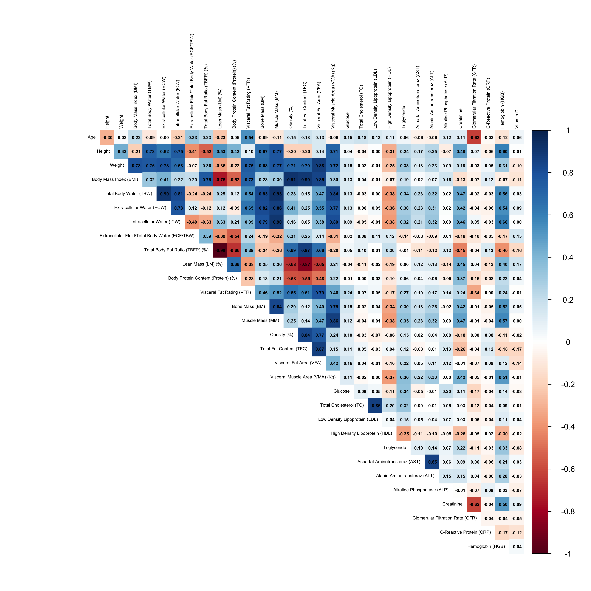
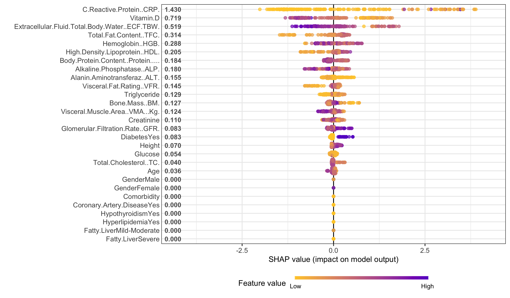
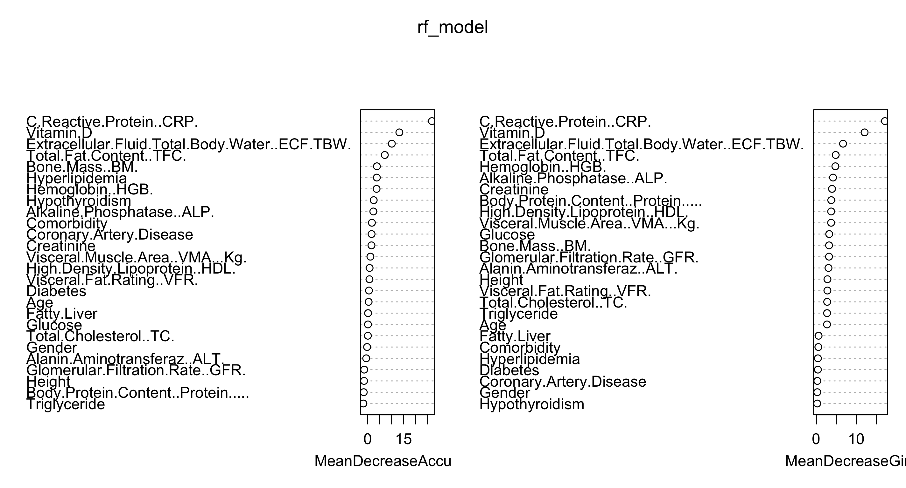

# Gallstone Prediction Using R

The goal is to achieve both:
- Strong predictive performance (best possible predictions)
- Model interpretability, so that important risk factors can be clearly understood using clinical and health data and compare multiple predictive models.

## Data Split
The dataset was split into training and testing data:
- Training data: 60%
- Testing data: 40%
- Random seed: 123

## Models Used
- Logistic Regression
- Stepwise Logistic Regression
- LASSO Logistic Regression
- Decision Tree
- Random Forest
- XGBoost with SHAP

## Model Evaluation
Models were evaluated using:
- Confusion Matrix
- ROC Curve
- AUC (Area Under the Curve)

ROC-based threshold tuning was applied using Youden’s J statistic.

## Dataset Information

This folder contains the dataset used for the Gallstone Prediction project.

**Source:** UCI Machine Learning Repository  
**License:** Creative Commons Attribution 4.0 International (CC BY 4.0)

The dataset is shared and used in compliance with the CC BY 4.0 license.

## Visualizations

### Correlation Heatmap
Used to identify multicollinearity among predictors before model building.

### SHAP Summary Plot
SHAP values were used to interpret feature contributions in the XGBoost model.

### Random Forest Feature Importance
Feature importance plot from the Random Forest model.

